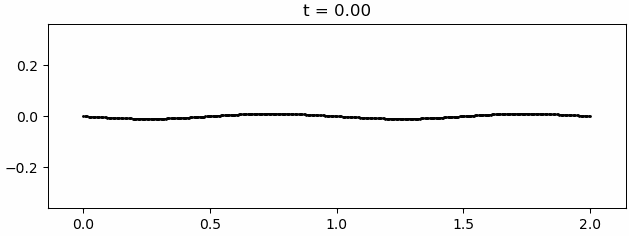

# vortex-sheet

Python implementation of the Rosenhead solution [1] of the vortex sheet as
described in Cottet & Koumoutsakos 2000 [2] (p. 15), Krasny solution [3]. 



```
[1] Rosenhead Louis 1931 The formation of vortices from a surface of discontinuity
    Proc. R. Soc. Lond. A134170–192. http://doi.org/10.1098/rspa.1931.0189

[2] Cottet & Koumoutsakos, Vortex Methods: Theory and Practice 
    Cambridge University Press https://doi.org/10.1017/CBO9780511526442

[3] Robert Krasny 1986 Desingularization of periodic vortex sheet roll-up
    J. Comput. Phys. Vol 65, 2 https://doi.org/10.1016/0021-9991(86)90210-X.
```

Run with `python vortex.py`

Based on numpy and scipy. List of used packages is available in `packages.txt`